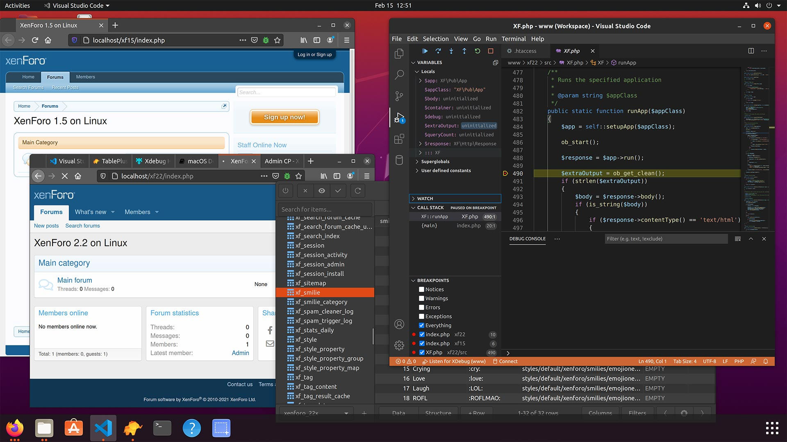
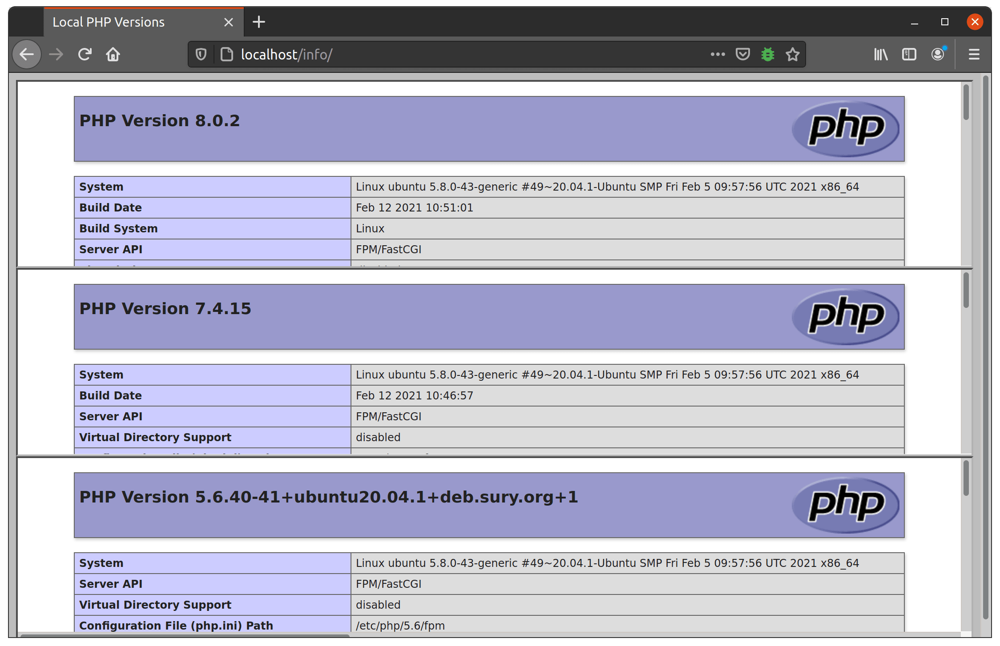

---
tags:
  - stable
---
# Linux development environment with concurrent PHP versions

To get the most out of the XenForo framework, you'll want to have a local webserver capable of running XenForo, along with capable debugger and a code editor that understands the code and can help you get around it.

Thankfully, these requirements are now simple to meet and won't cost you anything.

The following document and accompanying video will guide you step-by-step to installing everything you need to get started on a system based on Ubuntu Linux.

<div class="video-wrapper"><iframe width="560" height="315" src="https://www.youtube.com/embed/yzWzKjtvUIw" frameborder="0" allow="accelerometer; autoplay; clipboard-write; encrypted-media; gyroscope; picture-in-picture" allowfullscreen></iframe></div>

As with our [macOS development environment](macos-dev.md), this configuration will allow you to run **multiple versions of PHP _at the same time_**, so you could run instances of XenForo 1.5 on PHP 5.6, XenForo 2.1 on PHP 7.4 and XenForo 2.2 on PHP 8.0 if you wanted to, **without** having to manually switch the PHP version whenever you want to access a particular version.

Much of the explanation for what we're doing here can be found in our [macOS guide](macos-dev.md), so this document will be fairly short and to the point. If you'd like to just grab the install script then proceed straight to [configuring](#configuring), do so [here](files/linux/install-ubuntu.sh).



## Installing with Apt

This tutorial is based on an [Ubuntu](https://ubuntu.com) or [Debian](https://debian.org) system, but the principles can be applied to any Linux distribution that makes historical PHP packages available.

APT is the _Advanced Package Tool_ built into Debian-based Linux distributions. It makes the job of installing pre-configured software on Linux a lot less painful than it once was.

### Adding new repositories

To start, we need to instruct Apt to use some additional sources from which to grab packages.

In a terminal, run the following commands:

```bash
#!/bin/bash

# PHP versions for Ubuntu
sudo add-apt-repository -y ppa:ondrej/php

# TablePlus (optional)
wget -O - -q http://deb.tableplus.com/apt.tableplus.com.gpg.key | sudo apt-key add -
sudo add-apt-repository "deb [arch=amd64] https://deb.tableplus.com/debian tableplus main"

# ElasticSearch (optional)
wget -qO - https://artifacts.elastic.co/GPG-KEY-elasticsearch | sudo apt-key add -
echo "deb https://artifacts.elastic.co/packages/7.x/apt stable main" | sudo tee /etc/apt/sources.list.d/elastic-7.x.list

# Fetch the latest version info and upgrade existing packages
sudo apt update -y
sudo apt upgrade -y
```

If you are using Debian rather than Ubuntu, ignore the `ppa:ondrej/php` line, and run these instead, _before_ you run `apt update`:

```bash
sudo apt-get -y install apt-transport-https lsb-release ca-certificates curl
sudo curl -sSL -o /etc/apt/trusted.gpg.d/php.gpg https://packages.sury.org/php/apt.gpg
sudo sh -c 'echo "deb https://packages.sury.org/php/ $(lsb_release -sc) main" > /etc/apt/sources.list.d/php.list'
```

### Installing packages

Next, we'll get the software we need installed.

```bash
#!/bin/bash

# PHP stuff
sudo apt install php5.6-fpm -y
sudo apt install php7.4-fpm -y
sudo apt install php8.0-fpm -y
sudo apt install php-pear -y
sudo apt install php-memcache -y

# PHP modules
for module in xdebug imagick gettext gd bcmath bz2 curl dba xml gmp intl ldap mbstring mysql odbc soap zip enchant sqlite3
do
    for version in 7.4 5.6 8.0
    do
        sudo apt install php${version}-${module} -y
    done
done

# Apache web server
sudo apt install apache2 -y
# enable Apache FastCGI / FPM module
sudo a2enmod proxy_fcgi

# TablePlus (optional)
sudo apt install tableplus -y

# ElasticSearch (optional)
sudo apt install elasticsearch -y

# MariaDB (MySQL)
sudo apt install mariadb-server -y
```

!!! note
Given the presence of the `for` loops in this script, I'd suggest you save the contents of the box above into a script called `install.sh`, then `chmod 700 install.sh` to make it executable, and run it in a terminal.

## Configuring

With all the packages installed, we need to configure them to our needs.

### MariaDB

MariaDB / MySQL needs a little more work after it's installed.

In a terminal, run the following:

```sh title="Terminal"
sudo mysql_secure_installation
```

In this script, accept the defaults for everything, but ensure that you _do_ set a root password.

Next, run the MySQL client with `sudo`:

```sh title="Terminal"
sudo mysql -uroot -p
```

And after you have a working SQL prompt, enter the following queries:

```mysql
USE mysql;
UPDATE user SET plugin = '';
FLUSH PRIVILEGES ;
```

You can now exit mysql, and you won't need to run the MySQL client with `sudo` any more.

### Apache

We're going to keep all of our Apache configuration in one file.

Open `/etc/apache2/sites-enabled/000-default.conf`, and add the following code just before the closing `</VirtualHost>` line.

```apacheconf
ServerName localhost
Timeout 3600

<IfModule dir_module>
    DirectoryIndex index.html index.php
</IfModule>

DocumentRoot "/home/kier/Documents/www"

<Directory "/home/kier/Documents/www">
	Options Indexes FollowSymLinks
	AllowOverride all
	Require all granted
</Directory>

<FilesMatch \.php$>
	SetHandler "proxy:fcgi://localhost:9080"
</FilesMatch>
```

Those instances of `/home/kier/Documents/www` will need to be replaced with wherever you intend to store your www documents.

Make sure the directory exists before you start the Apache service.

### PHP

We don't need to change much from the default Ubuntu/Debian configuration for PHP, except for some Xdebug directives and instructions for how to run php-fpm.

#### Xdebug

Edit `/etc/php/5.6/mods-available/xdebug.ini` and give it the following contents for Xdebug 2.5.5:

```ini
zend_extension = "xdebug.so"
xdebug.remote_enable = 1
xdebug.remote_connect_back = 1
xdebug.remote_port = 9000
```

Next, edit `/etc/php/7.4/mods-available/xdebug.ini` and `/etc/php/5.6/mods-available/xdebug.ini` and give them both the following contents for Xdebug 3.0.x:

```ini
zend_extension = "xdebug.so"
xdebug.mode = "debug,develop"
xdebug.discover_client_host = 1
xdebug.client_port = 9000
```

#### php-fpm

Taking the PHP version number, removing the decimal point and adding the resulting integer to 9000, so that 5.6 becomes 9056 and 8.0 becomes 9080, create a file called `x.conf` in `/etc/php/(version)/fpm/pool.d/x.conf` for PHP versions 5.6, 7.4 and 8.0.

Give each file the following content:

```ini
user = kier
listen = 127.0.0.1:9056
```

... changing the username and the 90xx port number appropriately for each PHP version.

## Start services

You can now restart all the services with the new configurations:

```terminal
#!/bin/bash

sudo systemctl restart elasticsearch
sudo systemctl restart mariadb
sudo systemctl restart apache2
sudo systemctl restart php8.0-fpm
sudo systemctl restart php7.4-fpm
sudo systemctl restart php5.6-fpm
```

Everything should now be running, so you can follow [the instructions to work with multiple simultaneous PHP versions from the macOS guide](macos-dev.md#selecting-a-php-version), placing the files in the `www` directory you specified in your Apache configuration.



## Links to resources

- [dev.sury.org for PHP packages](https://deb.sury.org)
- [Visual Studio Code](https://code.visualstudio.com/)
- [TablePlus](https://tableplus.io/)
- [Xdebug](https://xdebug.org)
- [Xdebug Helper for Firefox](https://addons.mozilla.org/en-GB/firefox/addon/xdebug-helper-for-firefox/)
- [Video of this process](https://youtu.be/yzWzKjtvUIw)

---

## Summary

### Terminal commands

Run the installation commands for [Ubuntu](files/linux/install-ubuntu.sh) or [Debian](files/linux/install-debian.sh)

### Configure MariaDB / MySQL

Run the [mysql client as root with sudo](#mariadb), then execute SQL queries to disable plugin-based authentication for MySQL.

### Edit Apache VirtualHost

Edit `/etc/apache2/sites-available/000-default.conf` to include [custom configuration](#apache).

### Replace the following files

1. `/etc/php/5.6/mods-available/`[`xdebug.ini`](files/linux/php56/xdebug.ini)
1. `/etc/php/7.4/mods-available/`[`xdebug.ini`](files/linux/php74/xdebug.ini)
1. `/etc/php/8.0/mods-available/`[`xdebug.ini`](files/linux/php80/xdebug.ini)

### Add the following files

1. `/etc/php/5.6/fpm/pool.d/`[`x.conf`](files/linux/php56/x.conf)
1. `/etc/php/7.4/fpm/pool.d/`[`x.conf`](files/linux/php74/x.conf)
1. `/etc/php/8.0/fpm/pool.d/`[`x.conf`](files/linux/php80/x.conf)

### Restart services

Use `sudo systemctl restart ` for `elasticsearch`, `mariadb`, `apache2`, `php8.0-fpm`, `php7.4-fpm` and `php5.6-fpm`.

### PHP-version-targeting .htaccess files

The following files can be placed inside a directory on your webserver to have all PHP files within that folder use a particular version of PHP.

Rename the files from `htaccess.txt` to `.htaccess` after placing them in their destination folder.

1. PHP 5.6 [`.htaccess`](files/macos/php56/htaccess.txt)
1. PHP 7.4 [`.htaccess`](files/macos/php74/htaccess.txt)
1. PHP 8.0 [`.htaccess`](files/macos/php80/htaccess.txt)